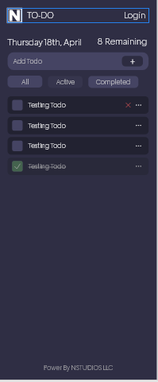

# Info
A Todo application using `Svelte 5` beta and `SvelteKit 2.5` With Vite. \
Instead of using `npm` will be using `Bun 1.1.4` \
The application uses `Typescript` and `Tailwind beta-4.0.0-alpha`

## Developing

Once you've created a project and installed dependencies with `bun install`, start a development server:

```bash
bun run dev

# or start the server and open the app in a new browser tab
bun run dev -- --open
```

## Building

To create a production version of your app:

```bash
bun run build
```

You can preview the production build with `bun run preview`.

> The Application is fully functional with Local Storage included and 
> a Drag and drop for the todos

## App Preview
### Responsive design

